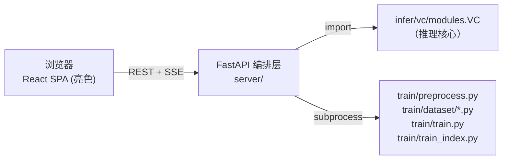
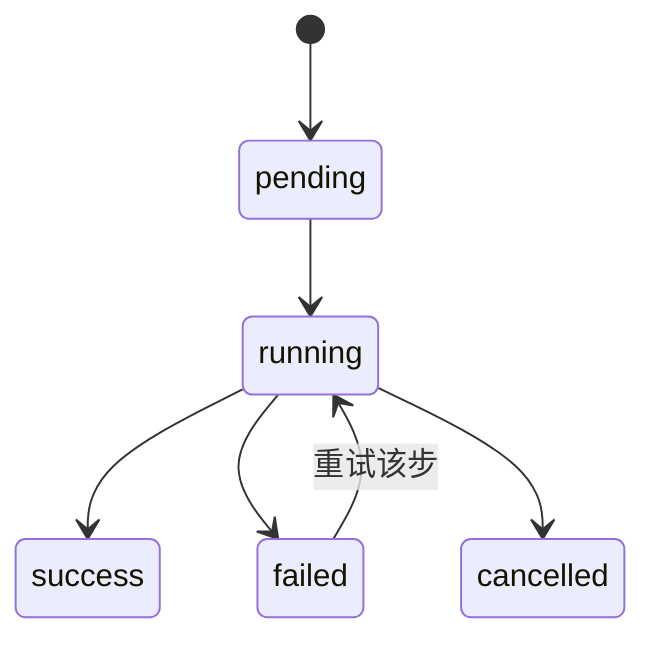

# RVC 新版 WebUI 设计方案（FastAPI + React）

- 日期：2026-09-06
- 状态：设计已与使用者逐段确认通过
- 范围：仅重写"编排层"（webui.py 的替代品），核心逻辑（train/、infer/）零改动

## 1. 背景与目标

现有 `webui.py`（2844 行 Gradio 3.14 应用）存在四个痛点：

1. 推理页十几个参数平铺，新用户无从下手
2. 训练要按 step1~step4 手动顺序点按钮，容易漏步骤
3. Gradio 样式天花板低、扩展性差
4. 模型/索引管理、试听对比等操作分散，无工作流闭环

目标：现代化界面 + 向导化训练流程 + 保持单命令启动。**使用场景为个人本地使用**，不引入用户系统、任务队列中间件、认证等设计。

## 2. 关键决策记录

| 决策 | 结论 | 理由 |
| --- | --- | --- |
| 架构方案 | A：FastAPI 后端 + TS 前端 SPA（静态托管） | 界面/交互全可控；单命令启动保留；未来可平滑升级 Tauri 桌面壳 |
| 前端框架 | React + Vite + TypeScript + shadcn/ui | 生态最大，适合工具型 UI |
| 主题 | 亮色（不用暗色） | 使用者偏好 |
| v1 范围 | 核心闭环：推理 + 训练 + 模型管理 | UVR5 人声分离、ckpt 工具留到 v2 |
| 新代码位置 | 顶层 `server/` + `frontend/` | 与核心目录平行，边界清晰 |
| 核心复用方式 | 推理直接 `import`；训练走 `subprocess` | `train/train.py` 用 `os._exit(0)` 退出且吃满统一内存，子进程隔离更安全 |
| 旧 webui.py | 保留不动，新旧并行 | 回退保险，新版稳定后再废弃 |
| 启动方式 | `python server/main.py` 一条命令，前端产物由 FastAPI 托管 | 使用简单 |
| 任务系统 | 内存任务表 + 全局训练互斥锁 | 单用户单机，无需 Redis/Celery |

## 3. 总体架构与目录结构



```
Retrieval-based-Voice-Conversion-WebUI/
├── train/  infer/  configs/        # 核心逻辑，完全不动
├── webui.py                        # 保留（回退用），新版稳定后废弃
├── server/                         # ★ 新增：FastAPI 编排层
│   ├── main.py                     #   入口：起服务 + 自动开浏览器
│   ├── api/
│   │   ├── infer.py                #   推理接口（import VC）
│   │   ├── training.py             #   训练 4 步（subprocess）
│   │   └── models.py               #   模型/索引扫描
│   ├── tasks.py                    #   内存任务表：{id, 状态, 进度, 日志缓冲}
│   └── static/                     #   前端构建产物（git ignore）
└── frontend/                       # ★ 新增：React + TS + Vite + shadcn/ui
    └── src/
        ├── pages/Inference.tsx     #   推理页
        ├── pages/Training.tsx      #   训练页（向导式）
        ├── pages/Models.tsx        #   模型管理页
        └── api/                    #   类型化 client
```

## 4. API 设计与训练任务状态机

### 4.1 REST 接口（v1 共 9 个）

```
模型与推理（同步，秒级返回）
GET  /api/models                    # 扫 assets/weights + indices，返回可配对的 (模型, 索引)
POST /api/infer                     # 单次推理，直接返回音频文件

训练（异步任务化，返回 task_id）
POST /api/train/preprocess          # 步骤1：切分重采样 → train/preprocess.py
POST /api/train/extract             # 步骤2：F0 + HuBERT 特征 → train/dataset/*.py
POST /api/train/fit                 # 步骤3：训练模型   → train/train.py
POST /api/train/index               # 步骤4：训练索引   → train/train_index.py
POST /api/train/pipeline            # 一键训练：串行执行 4 步

任务
GET  /api/tasks/{id}                # 状态 + 进度百分比 + 日志尾部
GET  /api/tasks/{id}/events         # SSE 实时日志流
DELETE /api/tasks/{id}              # 终止任务（杀进程组）
```

### 4.2 任务状态机



一键训练（pipeline）：前一步 success 才自动接续下一步；任一步 failed 整体 failed。

### 4.3 进度来源（复用现有日志文件）

| 步骤 | 进度计算 |
| --- | --- |
| preprocess / extract | 数产物文件数（如 `3_feature768/*.npy` ÷ `1_16k_wavs` 总数）→ 精确百分比 |
| fit | 解析 `train.log` step 行 + `total_epoch` 估算；loss 曲线透传前端绘图 |
| index | 秒级完成，running → success |

### 4.4 防坑设计

- 训练全局互斥：同时只允许一个 `fit` 任务，重复提交返回 409（避免 Mac 统一内存 OOM）
- 服务重启自愈：重启时将内存表中 running 任务标记为 `interrupted`（日志文件仍在 `logs/{exp}/` 可查）

## 5. 前端页面设计（亮色主题）

### 5.1 推理页 —— 解"参数太多太乱"

- 模型下拉 + 索引自动匹配
- 基础参数默认只露 4 个：变调滑条、音高算法（rmvpe）、音色相似度（index_rate）
- 其余参数（protect / rms_mix_rate / 重采样 / 检索方式…）收进"专家参数"折叠区
- 音频拖拽上传；转换前后 A/B 双播放器试听 + 下载

### 5.2 训练页 —— 解"训练流程繁琐"

向导步骤条：`① 实验配置 → ② 处理数据 → ③ 特征提取 → ④ 训练 → ⑤ 完成`

- 表单只问必要项：实验名 + 数据集文件夹；其余默认值（48k / v2 / rmvpe）收进折叠
- 每步完成自动进入下一步；进度条 + 滚动日志；单步失败可单独重跑
- 完成后"去试音"按钮跳转推理页并自动选中新模型

### 5.3 模型管理页 —— 解"缺少工作流整合"

- 模型卡片：名称、采样率、版本、epoch、索引配对状态（缺 index 黄色警告 + 一键补训索引）
- 操作：删除、去推理页使用

### 5.4 i18n

复用项目现有 `i18n/locale/*.json` 译文键。

## 6. 错误处理

- API 统一错误结构 `{code, message, detail}`；子进程失败时 `detail` 携带日志尾部 50 行
- 可预判错误给可操作提示：缺索引 → "去模型管理页补训索引"；OOM → "降低 batch_size 或换 32k 模型"；数据集 <1 分钟 → 提交前前端拦截警告
- 进程管理：`subprocess.Popen(start_new_session=True)` + 终止时 `killpg`，避免 dataloader 孙进程残留

## 7. 测试策略

| 层 | 策略 |
| --- | --- |
| server/ 逻辑 | pytest 单测：任务状态机、日志进度解析器（真实日志 fixture）、模型扫描 |
| API 集成 | FastAPI TestClient + mock subprocess，覆盖 9 个接口正常/异常分支 |
| 前端 | 向导流程手动走查为主，不追求覆盖率 |
| train/ infer/ 核心 | 零改动、零新增测试（现有行为即基线） |

## 8. 分阶段实施计划（每阶段结束均可独立使用）

| 阶段 | 内容 | 验收标准 | 预估 |
| --- | --- | --- | --- |
| P1 骨架跑通 | server 骨架 + 前端脚手架 + `GET /api/models` + 推理页 | 浏览器完成一次：选模型 → 传音频 → A/B 试听 | ~3 天 |
| P2 训练向导 | 4 步训练 API + 任务系统 + SSE 日志流 + 训练向导页 | 用 10 分钟样本完整训练一个音色并试音 | ~5 天 |
| P3 管理与打磨 | 模型管理页 + 缺索引警告 + 参数记忆（localStorage） | 全流程闭环走查无阻塞性问题 | ~2 天 |
