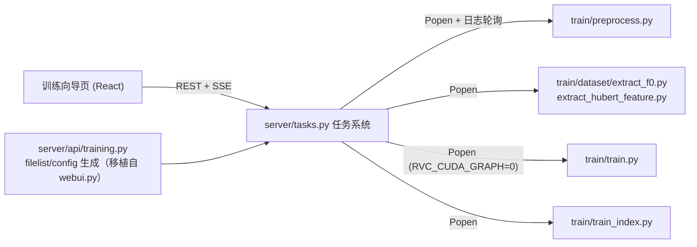

# P2 训练功能设计（新版 WebUI）

- 日期：2026-09-06
- 前置：P1 已交付（feature/new-webui 分支，27 测试全绿）
- 范围：单说话人训练全流程（多说话人留 P3）；平台无关（设备探测/回退由现有 configs/config.py 与 train.py 处理，编排层只透传参数）

## 1. 目标

在 P1 的 server + frontend 架构上补齐训练能力：用户在浏览器完成「配置 → 数据切分 → 特征提取 → 训练 → 索引」全流程（可分步可一键），实时看到日志与进度，训完直接在推理页试音。核心 `train/ infer/` 仍零改动。

## 2. 关键决策

| 决策 | 结论 | 理由 |
| --- | --- | --- |
| 编排来源 | 照抄 webui.py 的既有行为（命令行逐字复刻），移植而非 import | import webui 会构建整个 Gradio；行为对齐可保证训练产物与旧版完全兼容 |
| 任务模型 | 内存任务表 + 全局训练互斥（一次一个训练任务，含一键） | 单用户单机；Mac 统一内存/显存不允许并发训练 |
| 子进程方式 | `Popen(shell字符串, cwd=仓库根, start_new_session=True)`；fit 步骤注入 `RVC_CUDA_GRAPH=0` | 与 webui.py:779-796 `start_train_process` 一致；POSIX 进程组便于整树终止 |
| 终止方式 | 复用 `tools/process_utils.kill_process_tree`（POSIX killpg SIGTERM→SIGKILL） | 现成、已验证 |
| 进度来源 | 数产物文件（切分/提取）+ 解析 train.log（训练） | webui 无任何进度解析，需新写 |
| train.log 解析锚点 | `[step, lr]` 行与 `loss_disc=..., loss_gen=...` 行（纯数字格式，与 i18n 语言无关）；epoch 百分比行仅辅助 | 中英双语环境都稳 |
| 日志语义 | preprocess/extract/index 日志按 webui 惯例先截断再写；train.log 追加不截断（解析器记录偏移量增量读） | 对齐旧版行为 |
| 多说话人 | P2 不做；API 预留 `training_mode` 字段但仅支持 `"single"` | 复杂度翻倍，先跑通主干 |
| index_root | 维持 P1 语义：server 调 train_index.py 时传 `outside_index_root="assets/indices"` | link_added_index 直接把索引链进 P1 /api/models 扫描的目录，天然闭环 |

## 3. 架构



### 3.1 任务系统 `server/tasks.py`

- `Task` 数据：`id / name / state / progress / logs(环形缓冲) / processes[] / created_at / error`
- 状态机：`pending → running → success | failed | cancelled`；服务重启时内存表清空，`logs/{exp}/` 下日志文件仍在（设计 §4.4 的 interrupted 简化）
- 全局互斥：同一时刻仅一个训练类任务 running，重复提交返回 409
- 日志缓冲：每任务环形 deque(maxlen=1000)，SSE 订阅时先发存量再推增量

### 3.2 API（REST）

```
POST /api/train/preprocess   {exp_name, dataset_dir, sr?, n_p?}        → task_id
POST /api/train/extract      {exp_name, f0_method?, version?, if_f0?}  → task_id
POST /api/train/fit          {exp_name, sr, version, if_f0, total_epoch,
                              save_every_epoch, batch_size, save_every_weights?} → task_id
POST /api/train/index        {exp_name, version}                       → task_id
POST /api/train/pipeline     {同 fit 的全部字段 + dataset_dir}          → task_id（串行 4 步）
GET  /api/tasks              任务列表（含进度快照）
GET  /api/tasks/{id}         状态 + 进度 + 日志尾部
GET  /api/tasks/{id}/events  SSE：log / progress / status 三类事件
DELETE /api/tasks/{id}       终止（killpg，标记 cancelled）
```

- 参数默认值对齐 webui：`sr="48k"`、`f0_method="rmvpe"`、`version="v2"`、`if_f0=true`、`n_p=cpu_count`、`batch_size` 前端给推荐值
- fit 步骤内部顺序（移植 webui run_train_model）：生成 filelist.txt → 写 config.json → 拼命令 → 起子进程
- 底模选择移植 `get_pretrained_models`：`assets/pretrained{_v2}/{f0}{G,D}{sr}.pth` 存在性检查，缺失不带 `-pg/-pd` 并在任务日志中 warning

### 3.3 命令行契约（逐字复刻，全部 `cwd=仓库根`）

| 脚本 | 命令模板（python_cmd = sys.executable） |
| --- | --- |
| preprocess.py | `"{py}" train/preprocess.py "{dataset_dir}" {sr_int} {n_p} "{repo}/logs/{exp}" {noparallel} {per}`（noparallel=str(False)；per=config.preprocess_per 同源默认 3.7） |
| extract_f0.py (CPU路径) | `"{py}" train/dataset/extract_f0.py cpu "{repo}/logs/{exp}" {n_p} {f0_method}`（rmvpe 有 CUDA 卡时按 webui :977 分支拆多进程——P2 先走 CPU/单进程分支并留 TODO） |
| extract_hubert_feature.py | `"{py}" train/dataset/extract_hubert_feature.py {device} 1 0 "{repo}/logs/{exp}" {version} {is_half}`（7 参数形态；device 取 config.device 同源） |
| train.py | `"{py}" train/train.py -e "{exp}" -sr {sr} -f0 {0|1} -bs {bs} -te {te} -se {se} [-pg ... -pd ...] -l 0 -c 0 -sw {0|1} -v {version}` |
| train_index.py | `"{py}" train/train_index.py "{exp}" {version} "assets/indices" {n_cpu} single` |

已知怪癖必须复刻：布尔传参是 `"True"/"False"` 字符串；`extract_hubert_feature.py` 靠 argc 区分形态；路径全双引号包裹；`mute%s.wav` 的 `%s` 是 sr 串（`mute48k.wav`）。

### 3.4 filelist 与 config.json 生成（移植 webui.py:1169-1307，独立模块 `server/api/training.py`）

- 四目录（0_gt_wavs/3_feature*/2a_f0/2b-f0nsf）文件 stem 交集；空集 → 任务失败并报「没有可用于训练的有效音频」
- 行格式 `gt.wav|feature.npy|f0.npy|f0nsf.npy|sid`（sid=0）；追加 2 条 mute 行（`logs/mute/0_gt_wavs/mute{sr}k.wav|...`）；`random.shuffle` 后写 `logs/{exp}/filelist.txt`（`\n`.join，无结尾换行）
- config.json：`v2/48k` 等 `MODEL_CONFIG_FILES` 模板（v2+40k 复用 v1/40k.json）；已存在则沿用；无 speaker_info
- 产物校验沿用 webui `validate_*_outputs` 语义（交集非空，否则任务失败）

### 3.5 进度解析器 `server/progress.py`（新写）

| 阶段 | 分母/锚点 | 输出 |
| --- | --- | --- |
| preprocess / extract | 分母 = `1_16k_wavs` 文件数；分子 = 对应产物目录文件数 | progress 0-1 + 当前文件名 |
| fit | train.log 增量读（记录偏移）：`训练轮次：(\d+) \[(\d+)%\]`（双语兜底）、`\[(\d+), ([\d.eE+-]+)\]`（step/lr）、`loss_disc=([\d.]+), loss_gen=([\d.]+), loss_fm=([\d.]+),loss_mel=([\d.]+), loss_kl=([\d.]+)` | epoch 进度 + loss 五项曲线数据 |
| index | 无（秒级） | — |

### 3.6 前端

- **训练向导页**（设计 §5.2）：步骤条 `① 实验配置 → ② 处理数据 → ③ 特征提取 → ④ 训练 → ⑤ 完成`；表单必填仅实验名+数据集路径（数据集路径用文本输入，浏览器无目录选择能力），其余默认值折叠；每步完成自动进入下一步，可单步重跑；进度条 + 滚动日志（SSE）+ loss 曲线（轻量 SVG/Canvas，不引重图表库——YAGNI，或用 recharts 若已顺手）；完成后「去试音」跳推理页并选中新模型
- **模型管理页**（设计 §5.3）：模型卡片（名称/sr/version/epoch/索引配对状态/删除）+「补训索引」按钮（复用 index API）
- 任务 hook：`useTask(taskId)` 封装 SSE 订阅与重连

## 4. 错误处理

- 任务失败：detail 携带日志尾部（环形缓冲最后 N 行）+ returncode；失败可单步重跑（同 exp 幂等，脚本自身跳过已有产物）
- 409：已有训练任务在跑
- 400：实验名非法（路径穿越防护，同 P1 model 校验手法）、数据集目录不存在、f0_method 非法
- 校验失败（产物交集为空等）在任务内转为 failed + 明确中文信息

## 5. 测试策略

- tasks.py / training.py（filelist+config 生成）/ progress.py：pytest 单测为主（tmp_path 造假产物目录；真实 train.log 片段做 fixture；mock Popen）
- SSE：TestClient 流式断言
- 命令拼装：逐字快照测试（对每个脚本断言生成的命令串与 webui.py 模板一致）
- 前端：向导流程手动走查 + build 零错误
- 端到端验收：小样本（2-3 分钟音频）× 少 epoch（3-5）浏览器全流程走查

## 6. 实施阶段

| 阶段 | 内容 | 验收 |
| --- | --- | --- |
| P2a 后端 | tasks.py + filelist/config 移植 + 4 步 API + pipeline + 进度解析 + SSE | pytest 全绿；curl 走通 4 步（真实小样本，CPU/少 epoch）产出 .pth + .index |
| P2b 前端 | 任务 hook + 训练向导页 + 模型管理页 | 浏览器向导完成一次完整训练 → 推理页试音新模型 |
| P2c 收尾 | 端到端走查 + 审查遗留项清理 | 全流程闭环无阻塞 |
