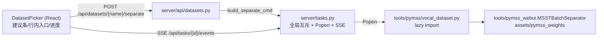

# 数据集人声分离设计（新版 WebUI）

- 日期：2026-09-07
- 前置：P1/P2 已交付（server + frontend 架构、训练向导五步）；旧版 Gradio webui.py 的 PyMSS 分离标签页可正常工作
- 背景：RVC 训练质量高度依赖干声。旧版把分离做成独立 Tab，默认用户「知道自己该先分离」，新用户常直接把带伴奏的歌传成训练集 → 训练数小时后才发现成品带伴奏泄漏。新版 WebUI 的设计文档将分离留到 v2，本设计补齐该能力，并把它接到训练向导的数据集环节。

## 1. 目标

用户在训练向导上传数据集后，能在**恰当的时机**（上传成功后、选择数据集时）以**轻量交互**发起人声分离；分离产出可直接作为训练数据集使用，与既有任务系统（互斥/进度/SSE/终止）完全复用。

## 2. 时机与交互（方案 A：数据集级操作 + 就地建议）

分离定位为**数据集层的衍生操作**（输入 `datasets/{name}/` → 输出新数据集 `{name}_vocals/`），不放向导步骤层：衍生数据集可跨实验复用，且不向传干声的用户强加一个永远跳过的步骤。两个触点：

1. **T2 上传成功后就地建议**：上传结果卡片下追加建议条（每次上传都出现；跳过后本会话内对该数据集不再提示）。服务端不做内容检测（误判代价高），宁可提示也不漏。
2. **T3 数据集行内常驻入口**：每行「分离」按钮 → 展开确认面板（模型下拉 + 文件数/时长 + 开始）。衍生数据集带 `← 来自 {源名}` 徽章，不再提供对衍生数据集再分离的入口。

分离是重任务且 opt-in：**永不自动执行**。确认面板不做耗时预估（无可靠的每模型速度系数，宁缺毋滥）。

## 3. 关键决策

| 决策 | 结论 | 理由 |
| --- | --- | --- |
| 执行方式 | 子进程命令（`python -m tools.pymss.vocal_dataset ...`），走既有 `TaskManager` | 分离核心依赖 torch/模型加载，进程隔离与服务进程的「延迟导入纪律」天然一致；互斥/终止（killpg）/日志增量读取全部零改动复用 |
| 分离核心 | 复用 `tools.pymss_webui.MSSTBatchSeparator`（经 lazy import） | 旧版生产路径：模型加载一次批量推理、线程池落盘、NaN 校验、DML 精度回退都已验证；模型清单即旧版 `MODEL_SPECS` 五个精选模型，权重目录 `assets/pymss_weights` |
| 产物 | 仅落盘目标 stem（人声），伴奏残余丢弃；文件名沿用 `{stem}_{suffix}.wav` | 训练用不上伴奏；省一半编码与磁盘。文件名对 preprocess 无影响 |
| 进度 | runner 打印 `[人声分离] 进度：i/n | 文件名`，`server/progress.parse_stage_progress_line` 直接解析 | 与切分/提取同一锚点协议，`_progress_state` 零改动获得进度与当前文件名 |
| 幂等 | 目标 stem 产物已存在 → 跳过该文件 | 任务失败/中断后重跑不重复计算；重复发起同一数据集分离天然安全 |
| 互斥 | 与训练共用 `task_manager` 全局互斥（一次一个重任务） | Mac 统一内存不允许训练与分离并发；`delete_dataset` 的「任务进行中 409 拒删」自动覆盖分离中的源/目标数据集 |
| 衍生标记 | `datasets/.meta/{衍生名}.derived.json` = `{source, model}` | .meta 在数据集目录之外（preprocess 不过滤文件名，目录内非音频文件会被误处理）；删除数据集时一并清理 |
| 衍生命名 | 恒为 `{name}_vocals`（去混响产物也在其中，语义为该数据集的「净化版」） | 单一后缀规则最简单；derived_from 标记记录真实来源与模型 |
| API 校验 | 模型 label 白名单在 `server/api/datasets.py` 静态维护（与 `MODEL_SPECS` 注释同源） | 服务进程不得 import `tools.pymss_webui`（顶层加载 torch）；runner 侧仍按 label 经 `resolve_model` 二次校验 |

## 4. 架构



### 4.1 runner `tools/pymss/vocal_dataset.py`

- **torch-free 模块**：`tools.pymss_webui` 只在真正开始分离时 lazy import（pytest 收集期不得加载 torch 的纪律）
- 纯逻辑（可单测）：`collect_inputs(input_dir)`（同 `datasets.AUDIO_SUFFIXES` 口径，点开头跳过）、skip 决策、进度行格式化、汇总统计
- IO 协议：stdout 逐行 `[人声分离] 进度：i/n | 文件名`、`[人声分离] 跳过（产物已存在）：文件名`、失败文件打印文件名 + traceback（继续下一个）；结束打印汇总行
- 退出码：0 正常（含全部跳过 / 部分文件失败但至少产出 1 个）；1 无任何产物且存在失败；2 用法错误（目录不存在 / 无音频 / 未知模型）
- 调用侧注入：`run_separation(..., batch_factory=...)`，测试用假 batch 替身；生产 batch_factory 内部才 import torch 栈

### 4.2 `MSSTBatchSeparator` 改动（tools/pymss_webui.py）

构造参数 `secondary_root` 允许 `None`：跳过伴奏 stem 的编码与落盘（`separate_file` 只提交目标 stem 的保存 future）。旧调用（传两目录）行为不变。

### 4.3 API（server/api/datasets.py）

```
POST /api/datasets/{name}/separate  {model?: str}   → {task_id, output_dataset, output_path}
```

- 校验：404 数据集不存在；400 无音频文件 / 未知模型 label；409 已有任务（TaskConflictError，同训练互斥）
- `model` 省略默认「去伴奏」（`MODEL_SPECS` 中 vocals-bs-roformer-368）
- 命令：`server/commands.build_separate_cmd(input_dir, output_dir, model)` → `"{py}" -m tools.pymss.vocal_dataset "{input}" "{output}" --model "{label}"`（cwd=仓库根）
- 任务日志：`datasets/.meta/{name}.separate.log`（.meta 在数据集目录之外，不进列表/详情）
- 建任务即写衍生标记 `.meta/{name}_vocals.derived.json`；`delete_dataset` 一并清理衍生标记与分离日志
- `GET /api/datasets` 每条 summary 增加 `derived_from: string | null`（读衍生标记）

### 4.4 前端（DatasetPicker）

- `client.ts`：`DatasetSummary.derived_from`、`api.separateDataset(name, model)`；`domain.ts` 增加 `SEPARATION_MODELS`（与后端白名单注释同源）
- 上传结果卡片下建议条（`[分离人声] [跳过]`，跳过按数据集名记忆）
- 行内「分离」→ 内联确认面板（模型 Select + 开始/取消）；衍生数据集隐藏该入口、显示徽章
- 发起后：行内进度条 + 当前文件名（`useTask` SSE，复用既有 hook）+「停止」（`cancelTask`，幂等 202）
- 成功终态：刷新列表 → 按输出名选中衍生数据集（`onSelect` 回填 dataset_dir，表单立即可提交）
- 重挂恢复：mount 时查 `GET /api/tasks`，存在非终态 `separate` 任务则恢复进度监视（不自动选中——重启后不知道源数据集的选中意图，由命令串解析过于脆弱）

## 5. 错误处理

| 场景 | 行为 |
| --- | --- |
| 模型 ckpt 缺失（`assets/pymss_weights/*.ckpt` 需另行下载） | runner FileNotFoundError → 明确文案「模型文件不存在：{路径}（请下载后放入 assets/pymss_weights）」→ 任务 failed，日志尾部进 error |
| 个别文件解码/推理失败 | 打印 traceback 继续下一个；结束汇总「成功 x / 失败 y」；y>0 且 x=0 才判失败退出码 |
| 数据集在分离中被删 | `delete_dataset` 对非终态任务 409 拒删（既有逻辑自动覆盖） |
| 训练/分离并发提交 | 全局互斥 409，文案指向正在运行的任务 |
| 服务重启 | 内存任务表清空（与训练同一语义）；已产出的文件保留，重新发起按幂等跳过续跑 |

## 6. 测试策略

- `tests/test_vocal_dataset.py`（新）：假 batch 替身驱动 `run_separation`——进度行格式、跳过幂等、失败继续、退出码三类、输入收集口径（后缀/点开头/非文件）；argparse 用法错误
- `tests/test_datasets_api.py`（扩展）：separate 端点 200/404/400×2/409；响应体含 output_dataset；列表 derived_from；delete 清理标记与日志
- `tests/test_commands.py`（扩展）：`build_separate_cmd` 快照
- `MSSTBatchSeparator` 的 secondary_root=None 分支：torch 依赖，不做单测（与该类现状一致），由端到端走查覆盖
- 端到端验收：真实小样本（1-2 首歌）浏览器走查 上传 → 建议 → 分离 → 自动选中 → 训练

## 7. 实施阶段

| 阶段 | 内容 | 验收 |
| --- | --- | --- |
| S1 后端 | runner + MSSTBatchSeparator 改动 + build_separate_cmd + 分离端点 + 衍生标记 | pytest 全绿；curl 发起真实分离（小样本）产出 `datasets/{name}_vocals`，GET /api/tasks/{id} 进度可达 1.0 |
| S2 前端 | client/domain 类型 + DatasetPicker 建议条/确认面板/进度/徽章/自动选中 | npm run build 零错误；浏览器走查 T2/T3 两触点 |
| S3 走查 | 端到端 + 边界（模型缺失文案、停止、409 互斥、失败重跑幂等） | 全流程闭环无阻塞 |
